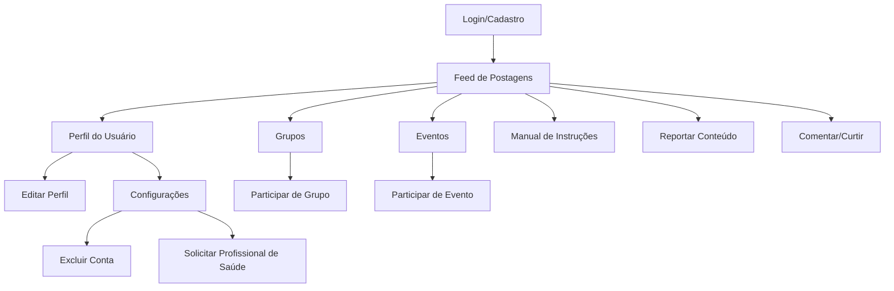

# APIs para Controle e Monitoramento

## APIs Disponíveis

- **/api/verificar-palavra**  
  Verifica se um texto contém palavras abusivas.
  - POST `{ texto: "mensagem a ser verificada" }`
  - Resposta: `{ ofensivo: true/false }`

- **/api/reportar**  
  Recebe reports de usuários.
  - POST `{ usuario: "nome", motivo: "motivo", detalhes: "detalhes" }`
  - Resposta: `{ status: "Report recebido", usuario, motivo }`

- **/api/reports**  
  Lista reports recebidos.
  - GET
  - Resposta: lista de reports

- **/api/verificar-documento**  
  Verifica a veracidade de documentos (exemplo fictício).
  - POST `{ documento: "dados", tipo: "crm/coren/etc" }`
  - Resposta: `{ verificado: true/false, mensagem: "..." }`

## Integrações Externas

- **/api/moderar-texto**  
  Usa a [Google Perspective API](https://www.perspectiveapi.com/) para analisar toxicidade de textos.
  - POST `{ texto: "mensagem" }`
  - Resposta: `{ score: 0.0-1.0, ofensivo: true/false }`
  - **Como usar:**  
    1. Crie uma conta no Google Cloud e ative a Perspective API.
    2. Substitua `YOUR_API_KEY` no código pela sua chave.
    3. Consulte a [documentação oficial](https://developers.perspectiveapi.com/s/docs).

- **/api/verificar-crm**  
  Consulta a API pública do Conselho Federal de Medicina para validar CRM.
  - POST `{ crm: "123456", uf: "SP" }`
  - Resposta: `{ resultado: ... }`
  - **Como usar:**  
    1. Veja a [documentação da API Consulta CRM](https://www.consultacrm.com.br/api).
    2. Adapte para outros conselhos (COREN, CREFITO, etc) conforme necessidade.

- **/api/reportar-externo**  
  Envia reports para um sistema externo de tickets (exemplo: Zendesk).
  - POST `{ usuario, motivo, detalhes }`
  - Resposta: `{ status, ticket }`
  - **Como usar:**  
    1. Crie conta em um serviço como Zendesk, Freshdesk, etc.
    2. Gere um token de API e configure no código.
    3. Consulte a [documentação da API do Zendesk](https://developer.zendesk.com/api-reference/ticketing/introduction/).

## O que adaptar

- Substitua as chaves de API e URLs pelos dados reais do seu serviço.
- Para conselhos profissionais, consulte se há API pública ou use scraping (atenção à legalidade).
- Para moderação, você pode usar outras APIs como Microsoft Content Moderator, OpenAI Moderation, etc.
- Para reports, qualquer sistema de tickets com API REST pode ser integrado.

## Como usar e atualizar

1. Instale as dependências:
   ```
   npm install express axios
   ```

2. Configure as chaves de API no código.

3. Execute a API:
   ```
   node public/apiprafuturasaplicacoes.js
   ```

4. Consulte os endpoints conforme descrito acima.

5. Para atualizar ou expandir:
   - Implemente lógica real de verificação de palavras abusivas.
   - Integre com banco de dados para reports.
   - Conecte a serviços de validação de documentos oficiais para médicos/atuantes da área.
   - Adicione autenticação/autorização conforme necessário.

6. Para futuras atualizações:
   - Crie novos endpoints conforme a necessidade do projeto.
   - Documente cada endpoint novo neste README.

---

# Manual de Funcionamento do HugDown

## Visão Geral

O HugDown é uma rede social inclusiva voltada para famílias, cuidadores, profissionais de saúde e pessoas com síndrome de Down.  
O objetivo é promover conexões, compartilhar experiências, criar grupos, participar de eventos e garantir acessibilidade e segurança para todos.

---

## Como o site está estruturado

- **Página Inicial:**  
  Apresenta as principais funcionalidades, estatísticas, atividades recentes e botões para login/cadastro.

- **Feed de Postagens:**  
  Onde você vê postagens de outros usuários, pode curtir, comentar, reportar e filtrar por categorias/tags.

- **Grupos:**  
  Espaço para criar ou participar de comunidades temáticas.

- **Eventos:**  
  Área para explorar, criar e participar de eventos presenciais ou online.

- **Perfil do Usuário:**  
  Mostra suas informações, postagens, selos de verificado/profissional de saúde, e opções de edição/configuração.

- **Configurações:**  
  Permite editar dados, excluir conta (com verificação por e-mail) e solicitar status de profissional de saúde.

- **Manual de Instruções:**  
  Disponível no rodapé e nas configurações, explica passo a passo como usar cada recurso.

---

## Esquemagrama de Navegação



---

## Progressão e Funcionalidades

1. **Cadastro/Login:**  
   - Crie sua conta, informe dados pessoais e aceite os termos.
   - Pode optar por se tornar profissional de saúde já no cadastro.

2. **Explorar o Feed:**  
   - Veja postagens, filtre por interesses, interaja com outros usuários.

3. **Participar de Grupos e Eventos:**  
   - Entre em grupos temáticos e eventos relevantes.
   - Crie seus próprios grupos/eventos se desejar.

4. **Interagir:**  
   - Comente, curta, reporte conteúdos.
   - Receba notificações e mensagens.

5. **Perfil e Configurações:**  
   - Edite suas informações, foto, biografia.
   - Solicite exclusão de conta ou status de profissional de saúde.

6. **Acessibilidade e Segurança:**  
   - Navegação por teclado, alto contraste, botões grandes.
   - Todas ações sensíveis exigem confirmação por e-mail.

7. **Manual de Instruções:**  
   - Consulte sempre que tiver dúvidas.
   - Explica cada passo e funcionalidade do site.

---

## Principais Recursos

- Postagens (texto, imagem, vídeo, PDF para profissionais)
- Comentários e curtidas
- Denúncia de conteúdo
- Grupos e eventos
- Perfil com selos de verificado e profissional de saúde
- Configurações avançadas (exclusão, solicitação de profissional)
- Notificações e mensagens diretas
- Manual de instruções e acessibilidade

---

## Dúvidas e Suporte

- Consulte o manual de instruções ou envie e-mail para:  
  **SuporteHugDown@gmail.com**

---

**O HugDown é feito para você se conectar, aprender e compartilhar com segurança e inclusão!**
